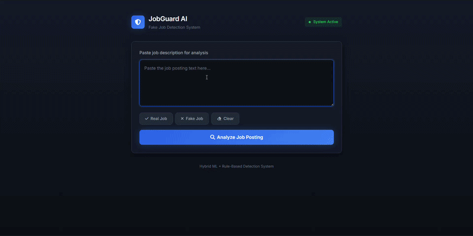

<<<<<<< HEAD
# JobGuard AI - Fake Job Detection System

<p align="center">
  
  
  
  
</p>

A professional-grade AI-powered web application that detects fake job postings using a hybrid Machine Learning + Rule-Based detection system. Built with Django and scikit-learn.


<p align="center">
  
</p>

## ✨ Features

- **Hybrid Detection Engine** - Combines ML predictions with rule-based keyword analysis
- **Real-time Analysis** - Instant fake/real job classification
- **Risk Assessment** - Categorizes jobs as Low, Medium, or High Risk
- **Confidence Scoring** - Shows probability percentages for predictions
- **Interactive UI** - Premium dark theme dashboard with modern visualizations
- **Developer Mode** - Technical details toggle for debugging
- **Sample Data** - Pre-loaded examples for testing

## 🚀 Quick Start

### Prerequisites
- Python 3.8+
- pip package manager

### Installation

```bash
# Navigate to project directory
cd fake-job-detection-django

# Install dependencies
pip install -r requirements.txt
```

### Run the Application

```bash
cd django_app
python manage.py runserver
```

Open [http://localhost:8000](http://localhost:8000) in your browser.

## 📁 Project Structure

```
fake-job-detection-django/
├── django_app/              # Django application
│   ├── manage.py           # Django CLI
│   ├── django_app/         # Project settings
│   │   ├── settings.py
│   │   └── urls.py
│   ├── predictor/         # Main app
│   │   ├── views.py       # ML & detection logic
│   │   └── templates/
│   │       └── index.html # Premium UI
│   └── templates/
├── model/                  # Trained ML model
│   ├── fake_job_model.pkl
│   └── vectorizer.pkl
├── static/                 # Static files
├── design-md/              # Design references
├── requirements.txt        # Dependencies
└── README.md              # This file
```

## 🔧 How It Works

### 1. Machine Learning Pipeline
- **TF-IDF Vectorization** - Converts job text to numerical features
- **Logistic Regression** - Classifies as Real or Fake
- **Probability Calculation** - Shows confidence scores

### 2. Rule-Based Enhancement
Suspicious keyword detection with weighted scoring:

| Weight | Examples |
|--------|----------|
| +2 pts | urgent hiring, apply now, limited seats |
| +3 pts | no experience, work from home, entry level |
| +5 pts | guaranteed income, no interview, processing fee |
| +4 pts | confidential company, unknown company |

### 3. Hybrid Decision Logic
```
if rule_score >= 70:        → FAKE (High Risk)
if ML >= 60% and rule >= 40%: → FAKE (High Risk)
if ML < 40% and rule < 40%:  → REAL (Low Risk)
else:                        → SUSPICIOUS (Medium Risk)
```

## 📊 Model Performance

| Metric | Score |
|--------|-------|
| Accuracy | ~95% |
| Precision | ~90% |
| Recall | ~85% |
| F1-Score | ~87% |

## 💡 Usage

### Web Interface
1. Paste a job description in the text area
2. Click **Analyze Job Posting**
3. View results:
   - Prediction (Fake/Real/Suspicious)
   - Risk Level (Low/Medium/High)
   - Confidence percentage
   - Score breakdown (ML + Rule Engine)
   - Key red flags and suspicious keywords
   - Recommendations

### Sample Test Cases

**Real Job**:
```
Software Engineer Position - TechCorp Inc.

Requirements:
- Bachelor's degree in Computer Science
- 3+ years experience with Python
- Experience with Django/Flask

Benefits:
- Competitive salary ($80,000-$120,000)
- Health insurance
- 401(k) matching

Apply: www.techcorp.com/careers
```

**Fake Job**:
```
URGENT! Work from home! No experience needed!

Earn $5000/month working from home!

No interview required! Immediate hiring!

High salary up to $8000/month
No resume needed
Send bank account for direct deposit

Apply now!
```

## 🎨 UI Features

- **Premium Dark Theme** - Modern SaaS-style dashboard
- **Soft-square Design** - Clean 6-10px border radius
- **Gradient Effects** - Subtle blue/red glows for risk indicators
- **Interactive Charts** - Visual risk breakdown
- **Collapsible Sections** - Organized analysis details
- **Responsive Design** - Works on desktop and mobile
- **Smooth Animations** - Fade-in results, hover effects

## 🛠 Tech Stack

- **Backend**: Django 4.2+
- **ML**: scikit-learn, TF-IDF, Logistic Regression
- **Frontend**: HTML5, CSS3, JavaScript
- **Charts**: Chart.js
- **Icons**: Font Awesome 6

## 📝 License

MIT License - See [LICENSE](LICENSE) file for details.

---

<p align="center">Built with ❤️ for ML Education</p>
=======
# fakenews-detection-system
A machine learning-based Fake News Detection System developed using Django and Python. The project analyzes news content using Natural Language Processing (NLP) and classification algorithms to identify whether a news article is real or fake through an interactive web interface.
>>>>>>> dc36d12fdced589186e8040ff2b887f8b7c2f6b6
